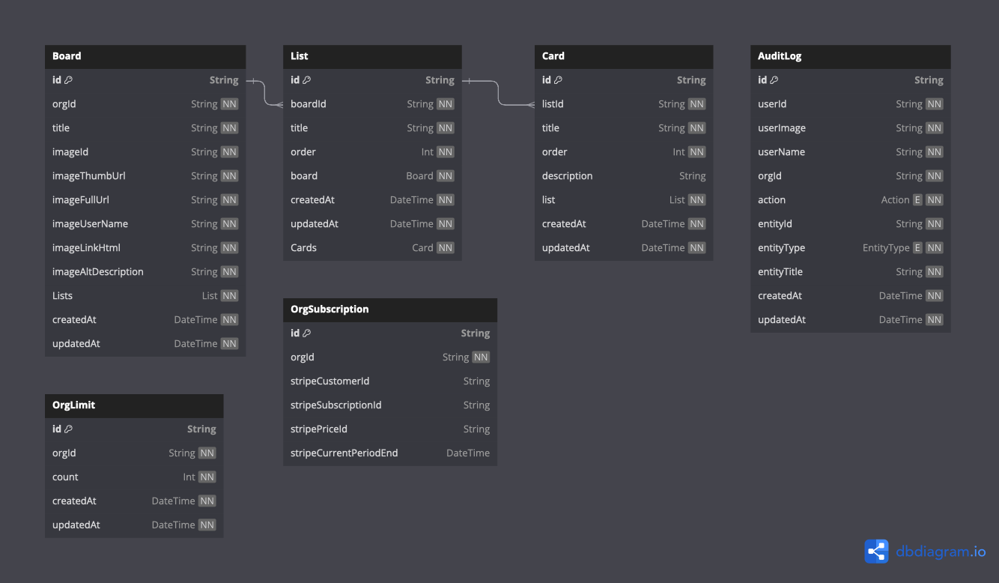
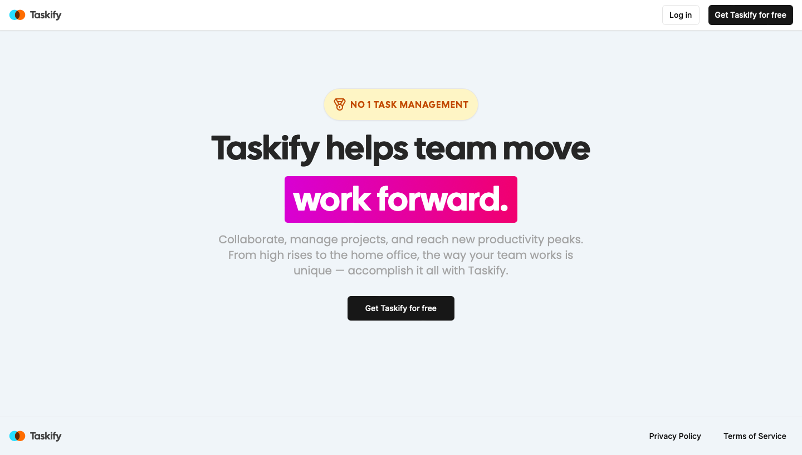
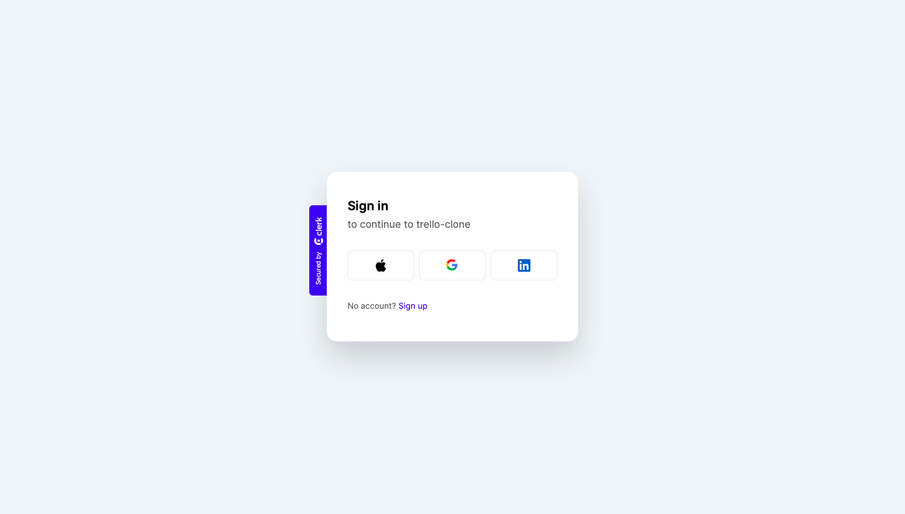
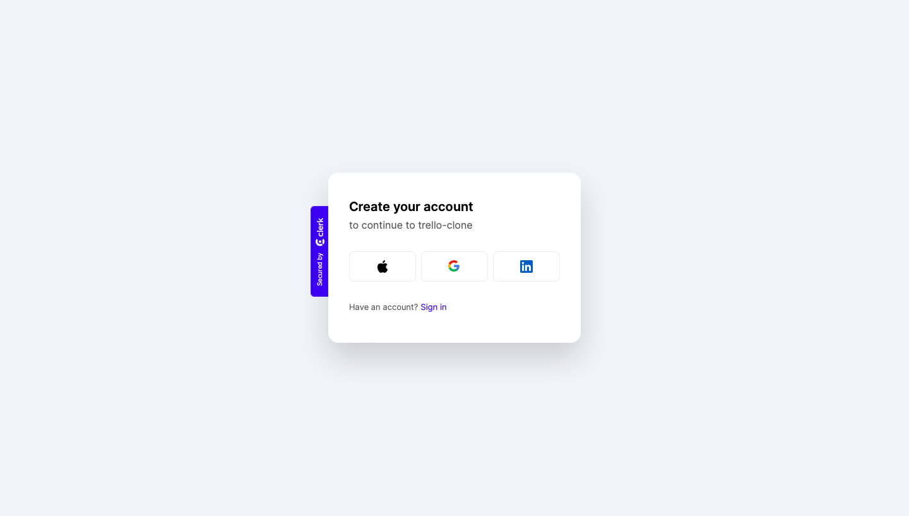
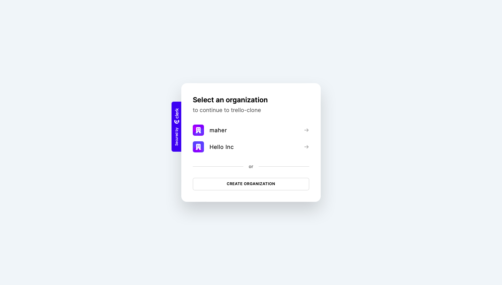
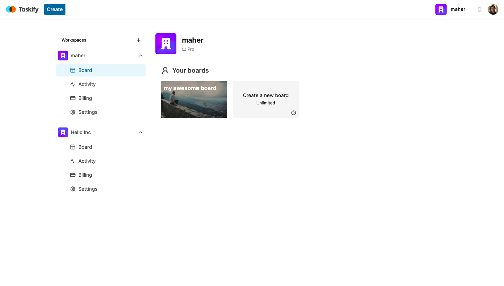
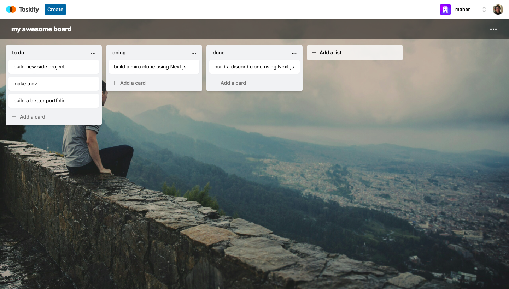
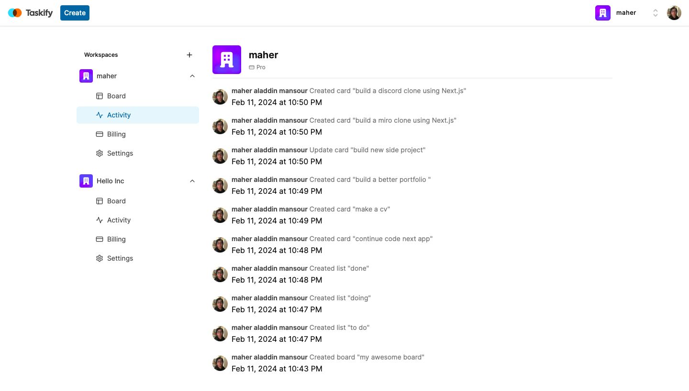
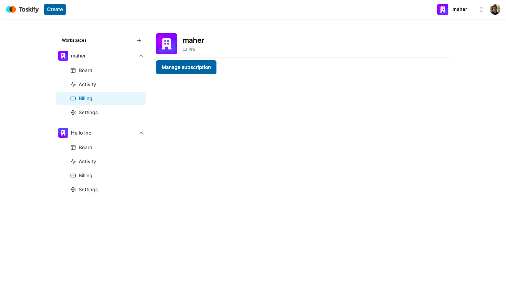
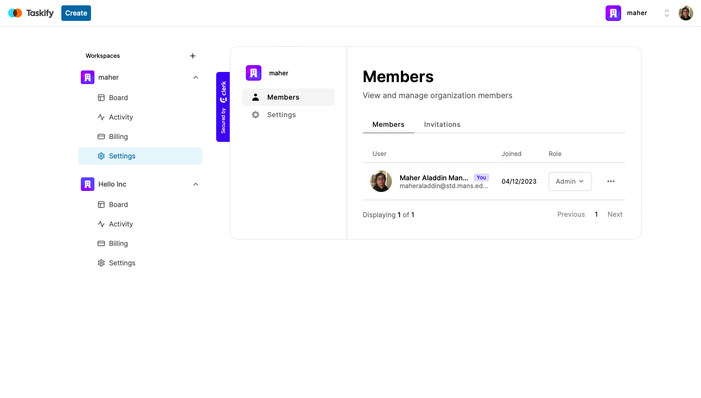

# Trello Clone

## Description

This is a simple Trello clone that allows you to create, edit, and delete boards, lists, and tasks. It also allows you to move tasks between columns and more...

## ERD

[Link to the ERD for the Trello clone.](https://dbdiagram.io/d/Trello-clone-65c947e1ac844320aee94704)

## Pages

- Marketing Page

- Sign in Page

- Sign up Page

- Select organization Page

- Dashboard Page

- Board Page

- Activity log Page

- Billing Page

- Settings Page

